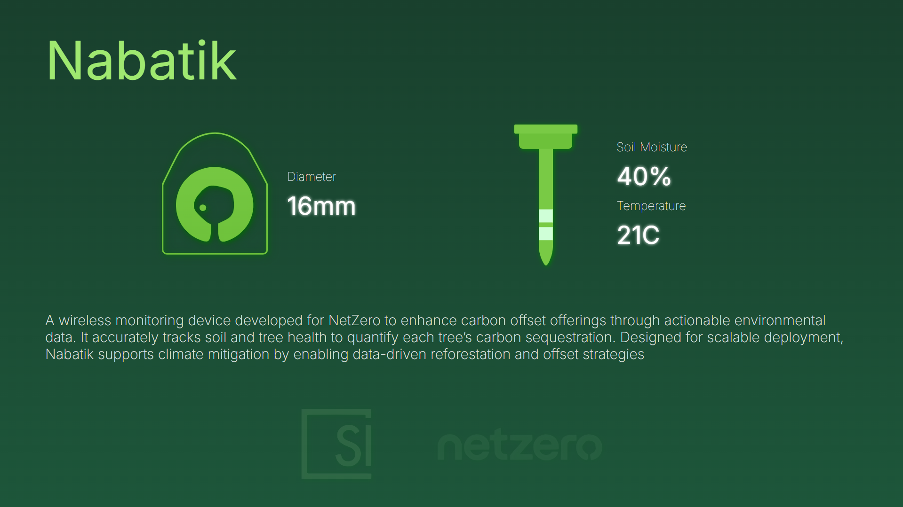

# Nabatik-mini-dashboard


## Overview

Nabatik-mini-dashboard is a lightweight real-time dashboard built with **Node.js** and **Express**.  
It displays live sensor readings for **Soil Moisture**, **Temperature**, and **Diameter**, averaging the last 7 readings for smoother visualization.  

The dashboard automatically updates using **Server-Sent Events (SSE)**, and you can simulate sensor input for testing.

---

## Features

- Real-time dashboard updates without page refresh  
- Shows averages of the last 7 readings  
- Supports multiple sensor types:  
  - Soil Moisture  
  - Temperature  
  - Diameter  
- Easy to send test data via API routes  
- Lightweight and easy to deploy locally  

---

## Installation

Clone the repository and install dependencies:

```bash
git clone https://github.com/sustainable-innovations/nabatik-mini-dashboard.git
cd nabatik-mini-dashboard
npm install
```

Start the server:

```bash
node server.js
```

Open your browser and go to:

```
http://localhost:3000
```

---

## Usage

### API Routes

Send sensor readings directly via the following **POST API routes**:

| Route | Description | Body |
|-------|-------------|------|
| `/soil_moisture` | Update soil moisture reading | `{ "value": <number> }` |
| `/temperature`   | Update temperature reading   | `{ "value": <number> }` |
| `/diameter`      | Update diameter reading      | `{ "value": <number> }` |

Example using `fetch` in JavaScript:

```javascript
fetch('/soil_moisture', {
  method: 'POST',
  headers: { 'Content-Type': 'application/json' },
  body: JSON.stringify({ value: 45 })
});
```

The dashboard will automatically update with the new values, showing the **average of the last 7 readings**.

---

### Optional Development Tips

- To automatically restart the server when making changes, install **nodemon**:

```bash
npm install -g nodemon
nodemon server.js
```

- The dashboard uses a **static folder (`public/`)** for HTML, CSS, and frontend scripts.  
- You can modify the frontend in `public/index.html` to customize the UI.

---

## Folder Structure

```
nabatik-mini-dashboard/
├── server.js          # Express API + SSE server
├── public/
│   └── index.html     # Frontend dashboard
├── screenshot.png     # Example dashboard screenshot
└── README.md          # This file
```
